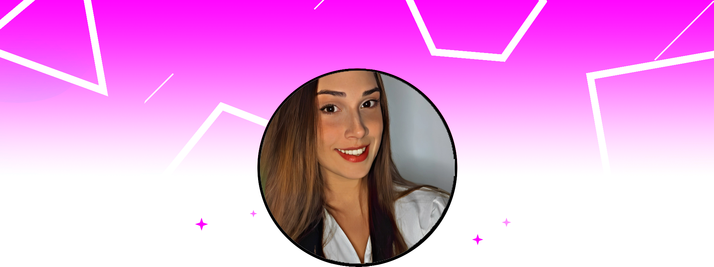

<!--

  Avatar
  

  

--->

###

###

Samara Nunes Teles  20y   Situada em Cascavel, Paraná, Brasil   - 📠Bacharel em Psicologia - Centro Universitário São Lucas  - 📚 Atualmente estou aprendendo mais sobre neurociência e técnicas avançadas de psicoterapia - 💖 No meu tempo livre, adoro malhar na academia, jogar vôlei, ler livros e jogar videogames

 

Um pouco mais sobre mim

<h3 align="left">Bio</h3>

Olá! Me chamo Samara, uma entusiasta da psicologia e psicóloga dedicada, atualmente com 20 anos. Meu objetivo é entender profundamente a mente humana e usar esse conhecimento para fazer a diferença na vida das pessoas.

Formei-me em Psicologia e estou no caminho para aprimorar minha carreira. Além das práticas clínicas e estudos contínuos, descobri o GitHub através de amigos e utilizo a plataforma como uma ferramenta essencial para meus projetos. Aqui, organizo minhas pesquisas, compartilho colaborações e exploro novas técnicas e metodologias na área de psicologia. Acredito que a interseção entre psicologia e tecnologia tem um potencial imenso para inovação na área da saúde mental.

##

<h3 align="left">🔥 Minhas atividades:</h3>

###
